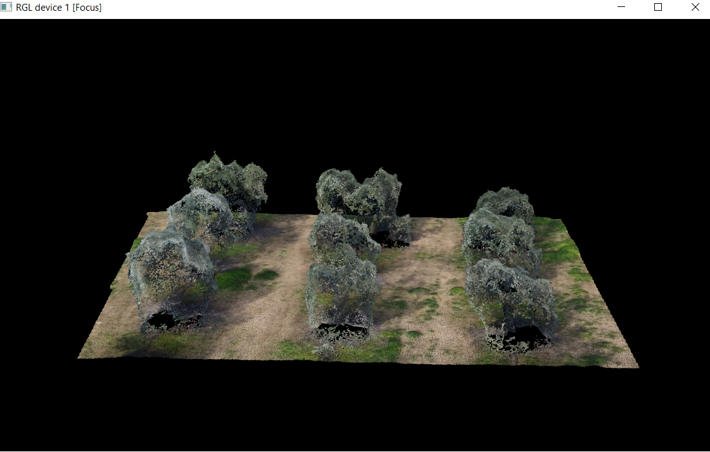
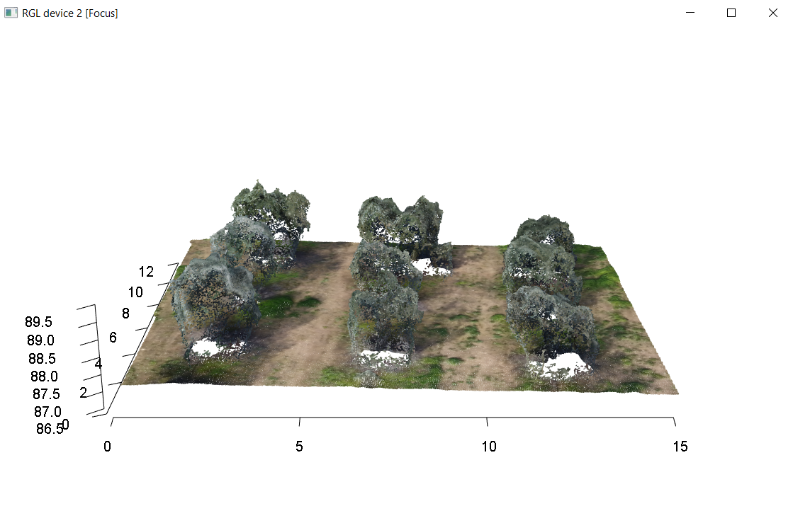
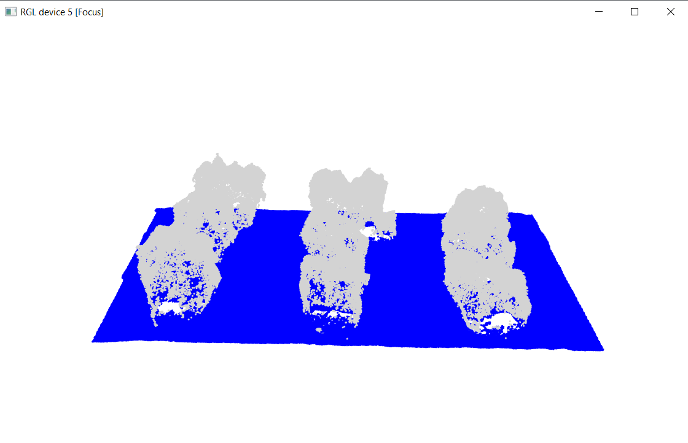
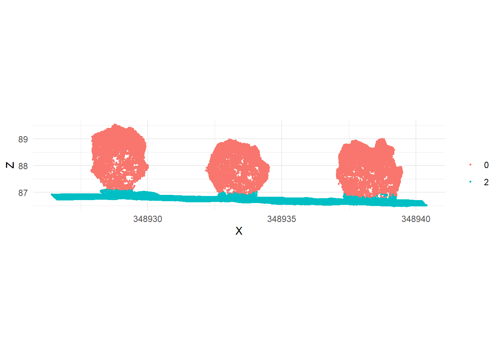
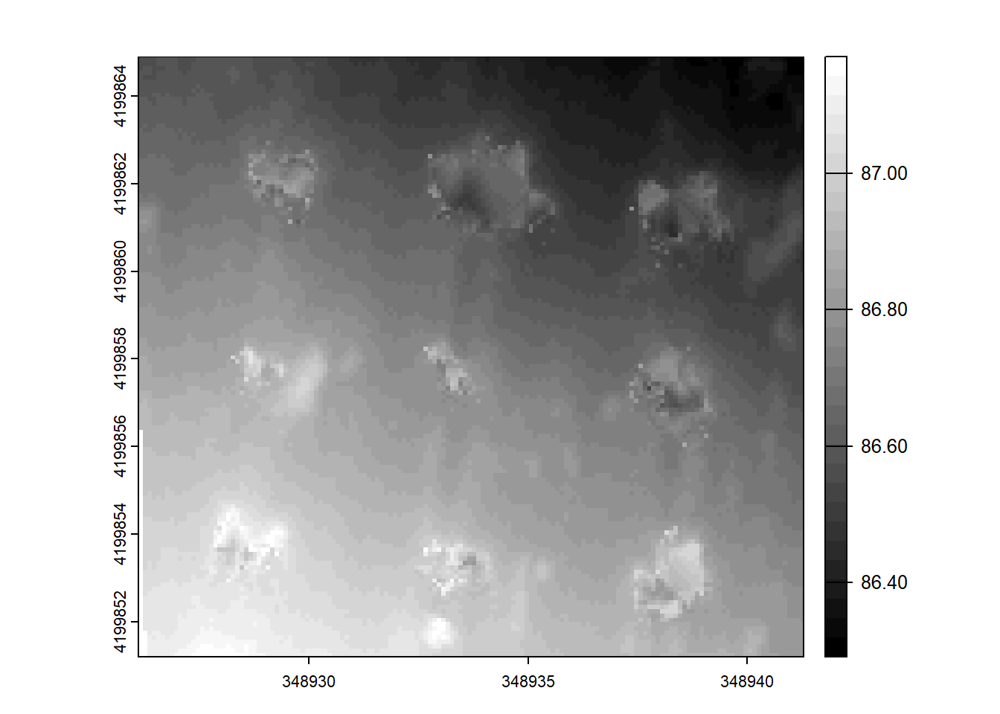
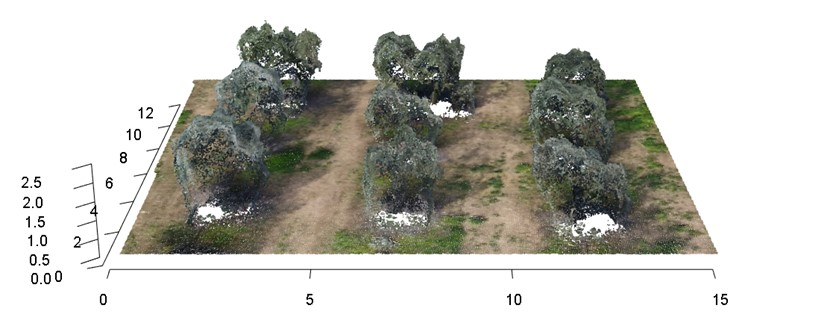
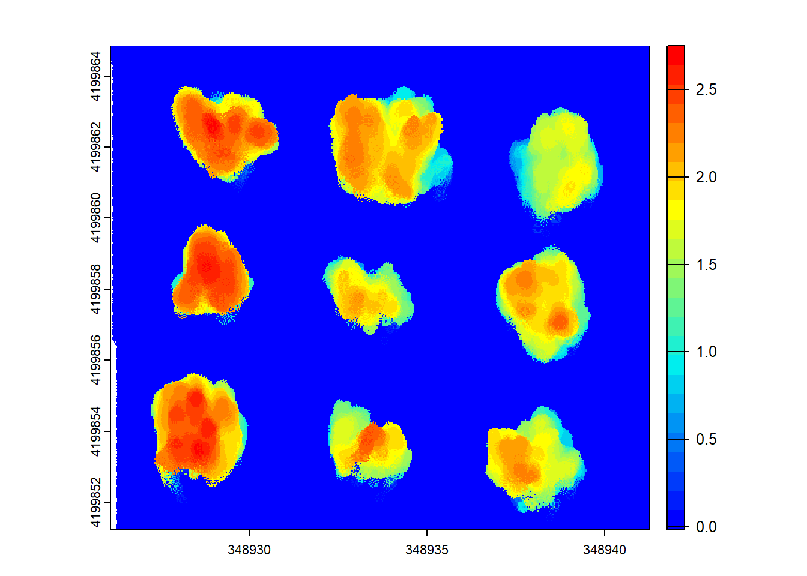

<a href="https://sandbox.zenodo.org/doi/10.5072/zenodo.71363"></a>

Carlos MARTÍN CORTÉS, Guillermo PALACIOS RODRÍGUEZ, Miguel Ángel LARA GÓMEZ, Rodrigo ARTHUS BACOVICH, Rafael Mª NAVARRO CERRILLO

# Capitulo 18: Aplicaciones Forestales UAS

## Tratamiento de Nubes de Puntos con lidR: Análisis de un Olivar

Este ejemplo se centra en el análisis de una zona de olivar utilizando datos fotogramétricos de alta resolución capturados mediante sistemas aéreos no tripulados (UAS), se mostrará cómo se procesa y analiza la información capturada con la ayuda
de la librería lidR en el entorno de programación R.

#### Objetivos:

- Comprender los principios básicos de la fotogrametría y su aplicación en entornos forestales
- Aprender a realizar un plan de vuelo para la captura de datos fotogramétricos
- Aprender a manejar y procesar datos fotogramétricos utilizando UAS
- Utilizar la librería lidR para:
  
1. Comprobación de nubes de puntos
2. Visualización de nubes de puntos
3. Voxelización de nubes de puntos
4. Clasificación del terreno
5. Creacción de modelos digitales
6. Detección de arboles
7. Extracción de datos dasométricos

#### Materiales Necesarios:
- Nube de puntos de olivar
- Software RStudio
- Guía de referencia rápida para la librería lidR

### Introducción

lidR es un paquete de R para manipular y visualizar datos de nubes de puntos para la realización de aplicaciones forestales.

El paquete es completamente de código abierto y está integrado dentro del ecosistema geoespacial de R.

Url de información: [https://r-lidar.github.io/lidRbook/]

### Instalación de paquete

En el entorno de R, los paquetes son conjuntos de funciones y datos que extienden las capacidades del lenguaje. Estos paquetes se utilizan para realizar tareas específicas, como análisis de datos, visualización, etc.

Antes de poder trabajar con un paquete en R, lo primero que tendremos que realizar es la instalación de este paquete. Para esta instalación tendremos que utilizar el siguiente comando: *install.packages()*

Dentro de este comando tendremos que poner el nombre del paquete entre comillas (“).

De la siguiente manera se instalará el paquete lidR y ggplot2:

```r
# Instalamos paquetes 
install.packages('lidR')
install.packages('ggplot2')
```

Después de instalar el paquete en R con install.packages(“lidR”), podemos cargarlo en nuestra sesión de R utilizando la función *library()*.

A diferencia de la instalación de paquetes, dentro de este comando no se tiene que poner el nombre del paquete entre comillas, si no que escribiremos el nombre sin comillas.

La función *library()* se utiliza para cargar paquetes previamente instalados en R, permitiendo acceder a sus funciones y datos. En el caso del paquete lidR, podemos cargarlo de la siguiente manera:

```r
# Cargamos los paquetes
library(lidR)
library(ggplot2)
```

### Carga de nube de puntos

El primer paso para la utilización de este paquete es la carga de nube de puntos.

Lo primero que debemos de conocer es que necesitamos tener la nube de puntos en formato *.las* o *.laz*.

Para cargar una nube de puntos se utiliza la función *readLAS()*.

Dentro de la función tendremos que poner la dirección del archivo completa, para ello tendremos que copiar ruta de acceso.

Una vez copiada la dirección, debería de aparecer de la siguiente manera: *C:\Users\users\Downloads\Nube_puntos_olivar.laz*

Es importante saber que, en R, las rutas que metemos en el programa nunca deberán ir con la siguiente barra: \, si no que deberían ir con la barra hacia el otro lado, es decir: /, que esta sería la línea divisoria.

Esta ruta la tendremos que meter en formato texto a R, por lo que tendrá que ir entre comillas.

Realizaremos una cadena de caracteres que contenga esta información.

En tu caso dentro tendrás que poner la ruta donde almacenes la nube de puntos.

```r
# Establecemos la ruta de la nube
ruta_nube <- "C:/Users/users/Downloads/Nube_puntos_olivar.laz"
```

Una vez que tenemos esta cadena de texto utilizar la función readLAS() de la siguiente manera:

```r
# Leemos la nube de puntos con la ruta establecida
las <- readLAS(ruta_nube)
```

O lo que seria lo mismo:

```r
# Leemos la nube de puntos con la ruta directamente
las <- readLAS("C:/Users/users/Downloads/Nube_puntos_olivar.laz")
```

A continuación, mostraremos un resumen de la información de esta nube de puntos con la función *print()*.

Cuando aplicamos *print()* a la nube de puntos, mostrará una representación legible de ese objeto. Esto es útil para inspeccionar el contenido de la nube de puntos y verificar si se han cargado correctamente, entre otras cosas.

```r
# Imprimimos la información de la nube de puntos
print(las)
```

```r annotate
## class        : LAS (v1.2 format 2)
## memory       : 21.3 Mb 
## extent       : 348926.1, 348941.3, 4199851, 4199865 (xmin, xmax, ymin, ymax)
## coord. ref.  : ETRS89 / UTM zone 30N 
## area         : 204.5 m²
## points       : 429 thousand points
## density      : 2097.62 points/m²
## density      : 2097.62 pulses/m²
```

Un primer paso importante en el procesamiento de datos de nubes de puntos es garantizar que los datos estén completos y sean válidos. Para eso utilizaremos la función *las_check()* para realizar una inspección de la nube de puntos.

Esta función comprueba si un objeto LAS cumple con las especificaciones LAS de ASPRS y si es válido para su procesamiento, dando advertencias en caso contrario.

```r
# Comprobamos la nube de puntos
las_check(las)
```

```r annotate
##  Checking the data
##   - Checking coordinates... ✓
##   - Checking coordinates type... ✓
##   - Checking coordinates range... ✓
##   - Checking coordinates quantization... ✓
##   - Checking attributes type... ✓
##   - Checking ReturnNumber validity... ✓
##   - Checking NumberOfReturns validity... ✓
##   - Checking ReturnNumber vs. NumberOfReturns... ✓
##   - Checking RGB validity... ✓
##   - Checking absence of NAs... ✓
##   - Checking duplicated points...
##     ⚠ 39947 points are duplicated and share XYZ coordinates with other points
##   - Checking degenerated ground points... skipped
##   - Checking attribute population...
##     🛈 'EdgeOfFlightline' attribute is not populated
##   - Checking gpstime incoherances skipped
##   - Checking flag attributes... ✓
##   - Checking user data attribute... ✓
##  Checking the header
##   - Checking header completeness... ✓
##   - Checking scale factor validity... ✓
##   - Checking point data format ID validity... ✓
##   - Checking extra bytes attributes validity... ✓
##   - Checking the bounding box validity... ✓
##   - Checking coordinate reference system... ✓
##  Checking header vs data adequacy
##   - Checking attributes vs. point format... ✓
##   - Checking header bbox vs. actual content... ✓
##   - Checking header number of points vs. actual content... ✓
##   - Checking header return number vs. actual content... ✓
##  Checking coordinate reference system...
##   - Checking if the CRS was understood by R... ✓
##  Checking preprocessing already done 
##   - Checking ground classification... no
##   - Checking normalization... no
##   - Checking negative outliers... ✓
##   - Checking flightline classification... yes
##  Checking compression
##   - Checking attribute compression...
##    -  ScanDirectionFlag is compressed
##    -  EdgeOfFlightline is compressed
##    -  Classification is compressed
##    -  Synthetic_flag is compressed
##    -  Keypoint_flag is compressed
##    -  Withheld_flag is compressed
##    -  ScanAngleRank is compressed
##    -  UserData is compressed
##    -  PointSourceID is compressed
```

Una vez comprobadas las especificaciones de la nube de puntos, pasaremos a visualizarla para ello utilizaremos la función *plot()*, dentro de esta función podemos visualizar la nube de puntos según su campo, pero en este ejemplo se mostrará la función en color RGB.

Importante saber que los funciona la visualización con color nubes de puntos que contienen información de color, como son las nubes de puntos fotogramétricas.

```r
# Visualizamos la nube de puntos fotogramétrica con color RGB
plot(las, color ="RGB")
```



Si en la anterior representación quisieramos añadir un eje y un fondo blanco, se realizaría de la siguiente manera:

```r
# Visualizamos la nube de puntos fotogramétrica con color RGB con ejes y fondo blanco
plot(las, color ="RGB", bg = "white", axis = TRUE)
```



### Voxelizado de la nube de puntos

Para reducir la densidad de puntos, trataremos de voxelizar la nube de puntos, esto lo realizaremos con la función *voxelize_points()*.

Nota: Al voxelizar la nube de puntos perderemos información, como RGB, Clasificación…

```r
# Voxelizado de nubes de puntos, con un paso de 0.04 metros
las_voxelizado<- voxelize_points(las, 0.04)
```

Podemos observar que la nube de puntos tenía un peso de 206.8 MB y ha pasado a 33.5 MB

Ahora imprimiremos la información de la nube de puntos para comprobar que se ha reducido el número de puntos.

```r
# Imprimimos la información de la nube de puntos voxelizada
print(las_voxelizado)
```

También podemos visualizar nuevamente la nube de puntos.

```r
# Visualizamos la nube de puntos voxelizada
plot(las_voxelizado)
```

### Clasificación del terreno

La clasificación del terreno es un paso importante. Distinguir entre puntos terrestres y no terrestres permite la creación de un modelo digital del terreno (MDT). Esta clasificación del terreno se realiza con la función *classify_ground()*.

```r
# Clasificamos los puntos de terreno con un tamaño de ventana de 5 metros y una altura de umbral de 0.25 metros
las <- classify_ground(las, algorithm = pmf(ws = 5, th = 0.25))
```

Una vez que hemos realizado la clasificación del terreno, podemos guardar la nube de puntos con la función *writeLAS()*:

```r
# Guardamos la nube de puntos
writeLAS(las, "D:/Nube_olivar_25830_clasificada.laz")
```

A continuación, podemos visualizar el resultado:

```r
# Visualización de la clasificación
plot(las, color = "Classification", size = 3, bg = "white") 
```



También se puede crear una función para visualizar la clasificación en 2D.

```r
# Creamos la función para visualización en 2D
plot_crossection <- function(las,
                             p1 = c(min(las@data$X), mean(las@data$Y)),
                             p2 = c(max(las@data$X), mean(las@data$Y)),
                             width = 4, colour_by = NULL)
{
  colour_by <- rlang::enquo(colour_by)
  data_clip <- clip_transect(las, p1, p2, width)
  p <- ggplot(data_clip@data, aes(X,Z)) + geom_point(size = 0.5) + coord_equal() + theme_minimal()

  if (!is.null(colour_by))
    p <- p + aes(color = !!colour_by) + labs(color = "")

  return(p)
}
```

Para realizar la visualización necesitaríamos dos puntos primero, estos dos puntos definen la línea que queremos visualizar en 2 dimensiones.

Estos puntos serán las coordenadas y deben de estar en el mismo sistema de coordenadas.

Nota: Estos puntos tienen que ser en el eje X.

```r
# Establecemos las coordenadas de los puntos 1 y 2
P1<- c(348926.51225 , 4199858.43604)
P2<- c(348940.3040 , 4199857.7980)
```

Una vez que tenemos los puntos podemos realizar la representación en 2D.

```r
# Visualizamos la nube de puntos en 2 D
plot_crossection(las, p1 = P1 , p2 = P2, colour_by = factor(Classification))
```



### Generación del modelo digital del terreno (MDT)

El Modelo Digital del Terreno (MDT) representa la superficie terrestre sin ninguna característica de la vegetación u otros objetos.

En lidR, podemos generar un MDT utilizando la función *grid_terrain()*.

```r
# Generación del MDT
mdt <- rasterize_terrain(las, algorithm = tin(), res = 0.1)
```

En este código:

1. *las* es tu nube de puntos cargada previamente.
2. algorithm = tin() especifica que se utilizará el método TIN (Triangulated Irregular Network) para la interpolación del terreno. Se pueden usar otros algoritmos.
3. res = 0.01 define la resolución del MDT en unidades de los datos, en este caso en metros. Lo que significa que el pixel resultante tendrá una altura de 10

Lo podemos visualizar utilizando la función plot.

```r
# Visualizamos el MDT 
plot(mdt, col =gray(0:30/30))
```



También lo podemos visualizar en 3D con *plot_dtm3d()*.

```r
# Visualizamos el MDT en 3D
plot_dtm3d(mdt, bg = "white")
```

Si queremos guardar el MDT como un archivo ráster, podemos utilizar la función *writeRaster()* del paquete terra.

Pero lo primero seria instalar y cargar el paquete ráster.

```r
# Instalamos y cargamos la libreria Terra
install.packages("terra")
library(terra)
```

Una vez que tenemos el paquete, procedemos con el guardado del archivo ráster.

```r
# Guardamos el raster
writeRaster(mdt, "H:/Curso_fotogrametria/MDT.tiff")
```

### Normalización de las alturas

La normalización de las alturas es un paso importante en el procesamiento de datos LiDAR para eliminar el efecto del terreno y obtener alturas relativas a un plano de referencia común, como el suelo. En lidR, puedes lograr esto mediante la siguiente formula:

Nube de Puntos Normalizada = Nube Original - Modelo digital del Terreno

```r
# Normalizado de la nube de puntos
las_normalizado <- las - mdt
```

Si visualizamos la nube de puntos, veremos que se encuentra normalizada.

```r
# Visualización de la nube de puntos normalizada
plot(las_normalizado, color ="RGB", bg = "white", axis = TRUE)
```



También podemos visualizarlo en 2 dimensiones, pero primero tendremos que rasterizar la nube de puntos con *rasterize_canopy()*.

```r
# Rasterización de la nube de puntos normalizada
chm <- rasterize_canopy(las_normalizado, res = 0.03, 
                        algorithm = p2r(subcircle = 0.10))
```

Una vez que tenemos la nube de puntos rasterizada ya la podemos visualizar, con la función *plot()*.

Además, realizaremos una paleta de colores para representar mejor las alturas.

```r
# Creamos la paleta de colores
col <- height.colors(25)

# Visualizamos la representación en 2D
plot(chm, col=col)
```



### Detección de árboles

La detección de árboles individuales, es el proceso de localizar espacialmente árboles.

Las copas de los árboles las podemos localizar usando la función *localizar_trees()*.

```r
# Localizamos árboles
ttops <- locate_trees(las, lmf(ws = 4.2))
```

En este código:

1. *lmf()*: especifica el método LMF para la detección de árboles.
2. ws = 4.2: ws es el tamaño de la ventana de búsqueda, que controla la sensibilidad de detección.

Podemos visualizar los puntos más altos de los árboles detectados.

1. Visualizamos la nube de puntos con *plot()*.
2. Añadimos los puntos más altos con *add_treetops3d()*.

A continuación, lo podemos observar:

```r
# Visualizamos la nube de puntos
x <- plot(las, bg = "white", size = 0.05))

# Visualizamos la localización de ttops
add_treetops3d(x, ttops)
```

Si imprimimos los resultados de *ttops* observaremos que tendremos la información del número de árboles y las coordenadas con x,y,z. Pero las alturas no las hemos obtenido ya que se encuentran en coordenadas absolutas.

```r
# Imprimimos la información de ttops
print(ttops)
```

```r annotate
## Simple feature collection with 9 features and 2 fields
## Attribute-geometry relationships: constant (2)
## Geometry type: POINT
## Dimension:     XYZ
## Bounding box:  xmin: 348928.8 ymin: 4199853 xmax: 348939.1 ymax: 4199863
## Projected CRS: ETRS89 / UTM zone 30N
##   treeID      Z                       geometry
## 1      1 89.692 POINT Z (348928.8 4199854 8...
## 2      2 89.446 POINT Z (348933.3 4199854 8...
## 3      3 89.536 POINT Z (348928.8 4199859 8...
## 4      4 88.961 POINT Z (348933.1 4199858 8...
## 5      5 89.163 POINT Z (348937.6 4199853 8...
## 6      6 88.991 POINT Z (348938.7 4199857 8...
## 7      7 88.954 POINT Z (348932.8 4199862 8...
## 8      8 89.513 POINT Z (348928.9 4199863 8...
## 9      9 88.432 POINT Z (348939.1 4199861 8...
```

Si queremos obtener las alturas de los árboles tendremos que normalizar las alturas al igual que en la nube de puntos.

Nota: Hay que pasar el mdt de spatRaster a RasterLayer. Necesitamos la función *raster()* de la libreria *raster*.

```r
# Instalamos el paquete raster
install.packages("raster")

# Cargamos el paquete
library(raster)
```

Procedemos a realizar la transformación.

```r
# Transformamos el mdt a Spatraster
mdt <- raster(mdt)

# Duplicamos ttops
ttops_normalizado <- ttops

# Realizamos el calculo 
ttops_normalizado[2]  <- ttops_normalizado[2] - mdt
```

Si imprimimos la información ahora veremos las alturas de cada árbol.

```r
# Printeamos Ttops normalizado
print(ttops_normalizado)
```

```r
## Simple feature collection with 9 features and 2 fields
## Attribute-geometry relationships: constant (2)
## Geometry type: POINT
## Dimension:     XYZ
## Bounding box:  xmin: 348928.8 ymin: 4199853 xmax: 348939.1 ymax: 4199863
## Projected CRS: ETRS89 / UTM zone 30N
##   treeID     Z                       geometry
## 1      1 3.118 POINT Z (348928.8 4199854 8...
## 2      2 2.875 POINT Z (348933.3 4199854 8...
## 3      3 2.964 POINT Z (348928.8 4199859 8...
## 4      4 2.394 POINT Z (348933.1 4199858 8...
## 5      5 2.581 POINT Z (348937.6 4199853 8...
## 6      6 2.392 POINT Z (348938.7 4199857 8...
## 7      7 2.353 POINT Z (348932.8 4199862 8...
## 8      8 2.922 POINT Z (348928.9 4199863 8...
## 9      9 1.853 POINT Z (348939.1 4199861 8...
```
