Carlos MARTÍN CORTÉS, Borja GARCÍA PASCUAL, Mauricio ACUNA, Guillermo PALACIOS RODRÍGUEZ, Miguel Ángel LARA GÓMEZ, Rafael Mª NAVARRO CERRILLO

# Capitulo 18: Aplicaciones Forestales UAS

## 1. Tratamiento de Nubes de Puntos con lidR: Análisis de un Olivar

Este ejemplo se centra en el análisis de una zona de olivar utilizando datos fotogramétricos de alta resolución capturados mediante sistemas aéreos no tripulados (UAS), se mostrará cómo se procesa y analiza la información capturada con la ayuda
de la librería lidR en el entorno de programación R.

#### Objetivos:

- Comprender los principios básicos de la fotogrametría y su aplicación en entornos forestales
- Aprender a realizar un plan de vuelo para la captura de datos fotogramétricos
- Aprender a manejar y procesar datos fotogramétricos utilizando UAS
- Utilizar la librería lidR para:
  
1. Comprobación de nubes de puntos
2. Visualización de nubes de puntos
3. Voxelización de nubes de puntos
4. Clasificación del terreno
5. Creacción de modelos digitales
6. Detección de arboles
7. Extracción de datos dasométricos

#### Materiales Necesarios:
- Nube de puntos de olivar
- Software RStudio
- Guía de referencia rápida para la librería lidR


# 2. Cálculo de Índices de vegetación a partir de imágenes multiespectrales y creación de mapas.

Este ejemplo se centra en el análisis de imágenes multiespectrales obtenidas por UAS para calcular índices de vegetación y crear mapas temáticos. A demás se aprenderá a como automatizar este proceso, todo se realizará desde el entorno de programación R.

#### Objetivos:
- Familiarizarse con las imágenes multiespectrales y su aplicación en la monitorización de la vegetación.
- Familiarización con los índices de vegetación más comunes.
- Aprender a calcular índices de vegetación y creación de funciones para poder calcularlos.
- Desarrollar habilidades en el manejo de Sistemas de Información Geográfica desde un entorno de programación para la creación de mapas temáticos basados en los índices calculados.
- Interpretación de los mapas generados.

#### Materiales Necesarios:
- Orto mosaicos multi-espectrales
- Software RStudio


### Instalación y carga de librerías

Para trabajar con gráficos y datos geoespaciales en R, primero debemos instalar, y luego cargar varias librerías esenciales.

En este ejemplo, utilizaremos ggplot2, terra y sf. A continuación, se muestra cómo instalar estas librerías (si aún no las tienes instaladas) y cómo cargarlas para su uso.

##### Instalación de las librerías

Si no tienes estas librerías instaladas en tu entorno de R, puedes instalarlas utilizando el comando **install.packages()**.

```r
#Instalamos librerias
install.packages("ggplot2")
install.packages("terra")
install.packages("sf")
install.packages('ggspatial')
```

##### Carga de las librerías

Una vez instaladas las librerías, podemos cargarlas en nuestro entorno de trabajo usando la función **library()**.

```r
# Cargamos librerias
library(ggplot2)
library(terra)
library(sf)
library(ggspatial)
```

##### ggplot2

Esta librería es parte del conjunto de herramientas tidyverse y se utiliza para crear gráficos de alta calidad en R. Ofrece una forma consistente y poderosa de crear una amplia variedad de gráficos de manera eficiente. Url de información: (https://ggplot2.tidyverse.org/)[https://ggplot2.tidyverse.org/]

A continuación se puede observar el **CHEATSHEET**:

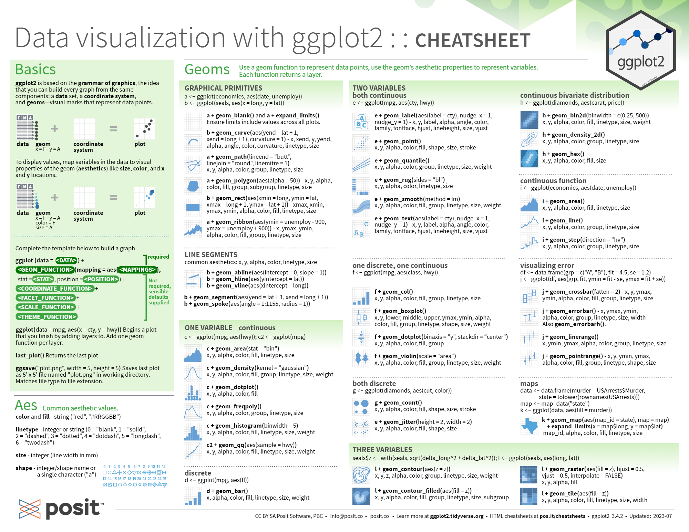

##### terra

Esta es una librería diseñada para el análisis y manejo de datos raster. Los datos raster son representaciones matriciales de datos espaciales. Url de información: (https://rspatial.org/pkg/)[https://rspatial.org/pkg/]

##### sf

Esta librería facilita el manejo de datos espaciales simples, especialmente datos vectoriales. sf soporta el uso de geometrías (puntos, líneas , polígonos). Url de información: (https://r-spatial.github.io/sf/)[https://r-spatial.github.io/sf/]

A continuación se puede observar el **CHEATSHEET**:

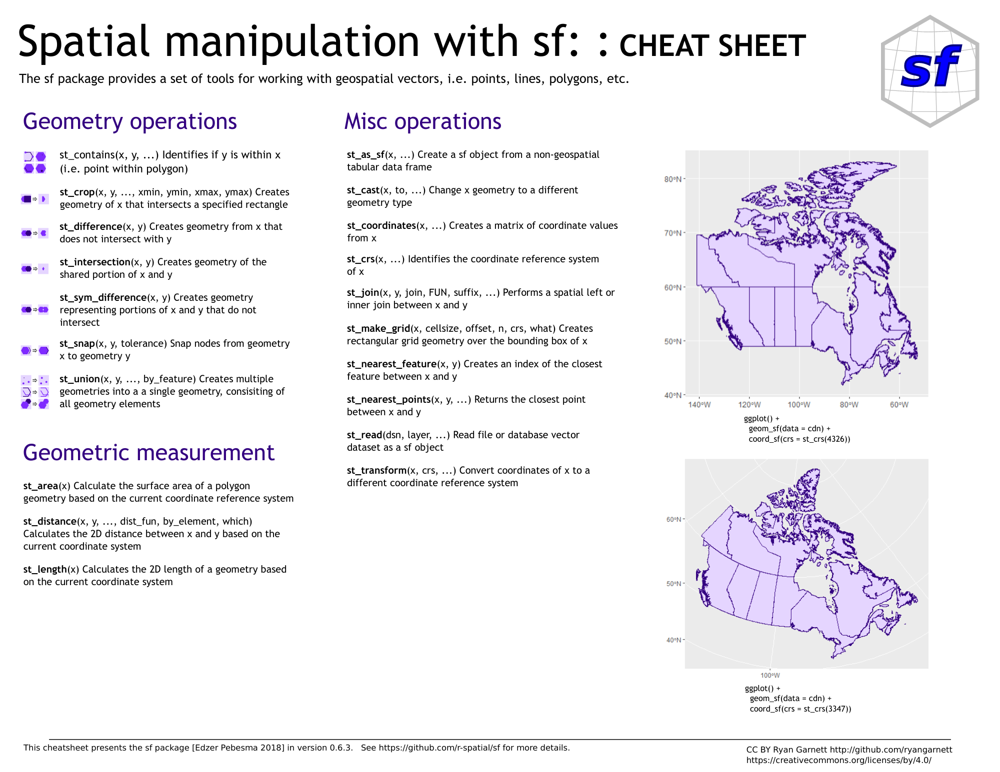

##### ggspatial

Esta librería proporciona funciones adicionales para trabajar con datos geoespaciales en ggplot2, permitiendo agregar elementos como coordenadas, escalas y mapas base a los gráficos creados con ggplot2. Url de información: (https://paleolimbot.github.io/ggspatial/)[ttps://paleolimbot.github.io/ggspatial/]

### ¿Qué es una imagen multiespectral?

Para poder comenzar, primero realizaremos una breve explicación de que es una imagen multiespectral:

Una imagen multiespectral es una representación de una escena capturada en múltiples bandas espectrales. A diferencia de una imagen convencional, que contiene tres bandas (rojo, verde y azul), una imagen multiespectral puede incluir varias bandas adicionales, cada una capturando información en diferentes rangos del espectro electromagnético.

En el caso de este ejemplo trabajaremos con una imagen multiespectral que contiene cuatro bandas: 
- Banda 1: Rojo
- Banda 2: Verde
- Banda 3: Azul
- Banda 4: Infrarrojo

#### Apertura y visualización de una imagen multiespectral

En esta parte del ejemplo, comenzaremos por abrir una imagen multiespectral y visualizarla.

##### Carga de una imagen multiespectral

Primero, cargaremos la imagen multiespectral desde el archivo que se adjunta. Para poder cargar la imagen debemos de conocer la ruta donde tenemos esta imagen.

Esta misma imagen la podemos conseguir en el Dataset de Pix4Dcloud, se encuentra en el siguiente enlace: (https://cloud.pix4d.com/site/26624/dataset/91715/map?shareToken=41648cb2-a688-47a3-b4a2-21f21431c94b)[https://cloud.pix4d.com/site/26624/dataset/91715/map?shareToken=41648cb2-a688-47a3-b4a2-21f21431c94b]

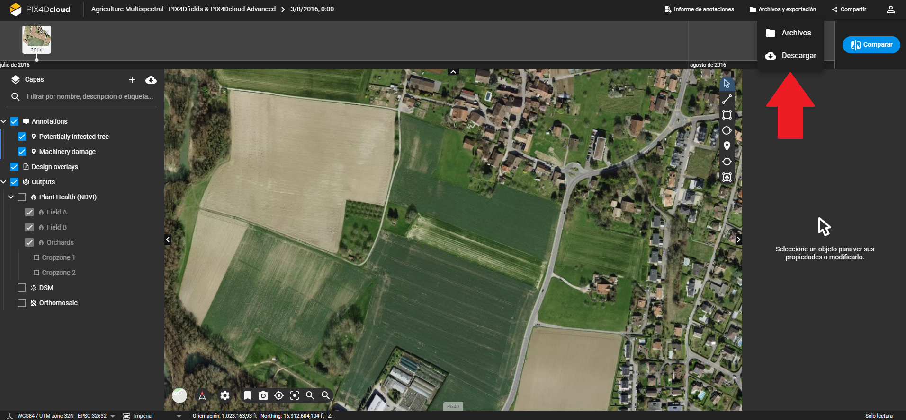

```r
# Especificamos la ruta al archivo de la imagen multiespectral
ruta_imagen <- "D:/Ecublens_20160803_transparent_mosaic_group1.tif" #Adaptar a donde se haya realizado la descarga en el paso anterior
```

Una vez que tenemos la ruta, se procederá a cargar la imagen con la función rast() de la librería terra.

```r
# Abrir la imagen multiespectral utilizando la función rast()
imagen_multiespectral <- rast(ruta_imagen)
```

##### Carga de una imagen multiespectral

Una vez cargada la imagen, podemos visualizarla utilizando la función plot(). Esta función nos permite crear una representación gráfica de la imagen raster.

```r
# Visualizamos la imagen multiespectral
plot(imagen_multiespectral)
```

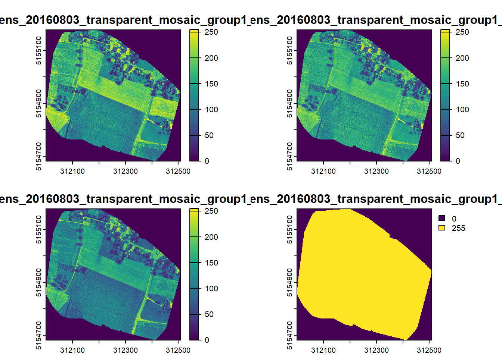

Como podemos observar directamente, nos da tres gráficos, pero no sabemos a que banda se refiere cada uno, por lo que procederemos a visualizarlos de forma individual:

```r
# Primero dividimos la pantalla en 2 filas y 2 columnas
par(mfrow = c(2, 2))

# Visualizamos las cuatro bandas de la imagen multiespectral

# Visualización de la banda 1
plot(imagen_multiespectral[[1]], main = "Banda 1 - Rojo")

# Visualización de la banda 2
plot(imagen_multiespectral[[2]], main = "Banda 2 - Verde")

# Visualización de la banda 3
plot(imagen_multiespectral[[3]], main = "Banda 3 - Azul")

# Visualización de la banda 4
plot(imagen_multiespectral[[4]], main = "Banda 4 - Infrarrojo")
```

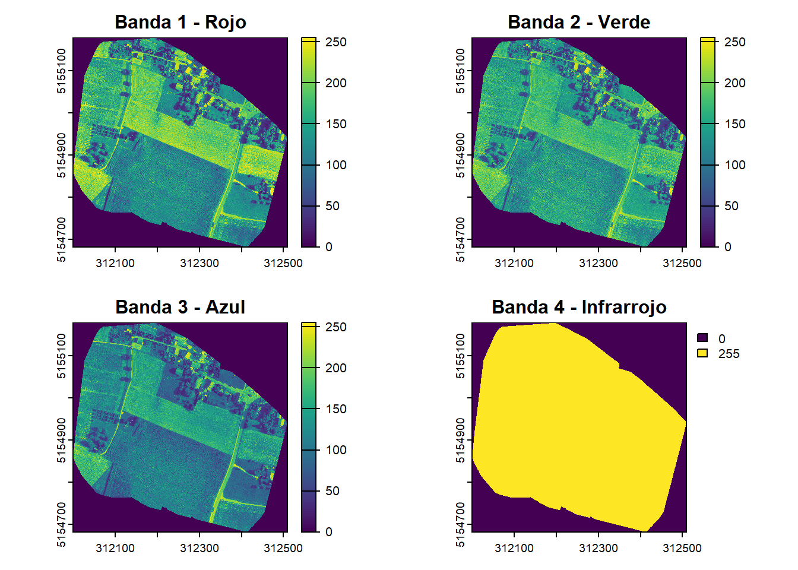

##### Visualizamos en color real

También podemos visualizar la imagen en color real con la función plotRGB(), para obtener la visualización en color real, utilizamos las tres bandas correspondientes a los colores rojo (R), verde (G) y azul (B).

```r
# Visualización en color real
plotRGB(imagen_multiespectral, r = 1, g = 2, b = 3)
```

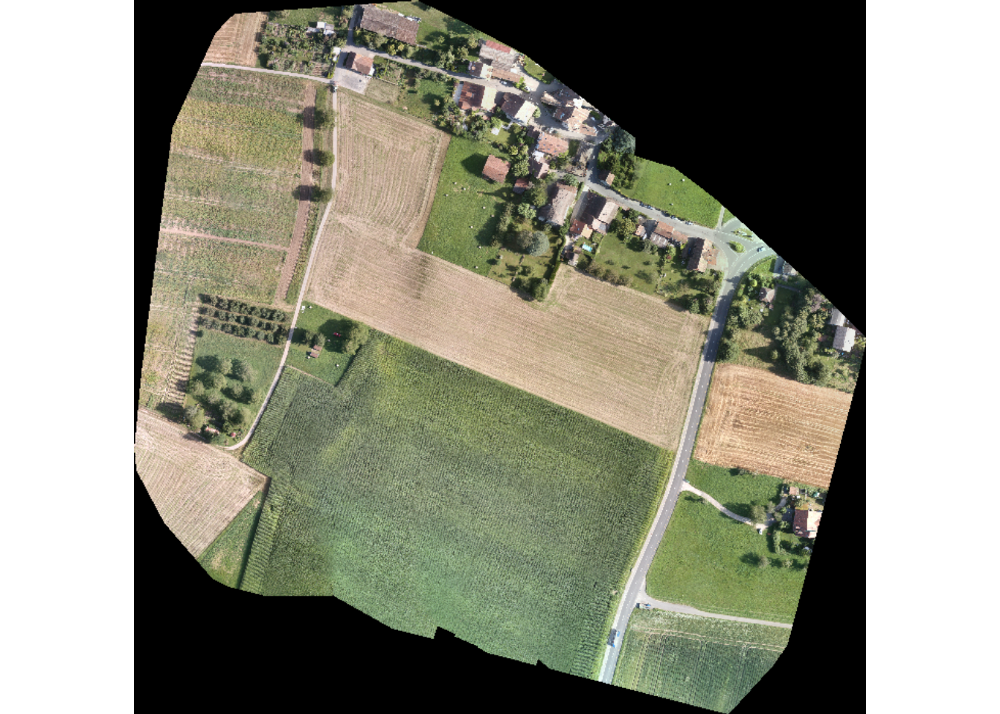

##### Visualizamos en falso color

En el caso de la visualización en falso color, comúnmente se utiliza la banda del infrarrojo cercano (NIR) junto con las bandas del rojo y verde. Esto resalta la vegetación, ya que las plantas reflejan fuertemente el infrarrojo cercano.

```r
# Visualización en falso color
plotRGB(imagen_multiespectral, r = 4, g = 1, b = 2)
```

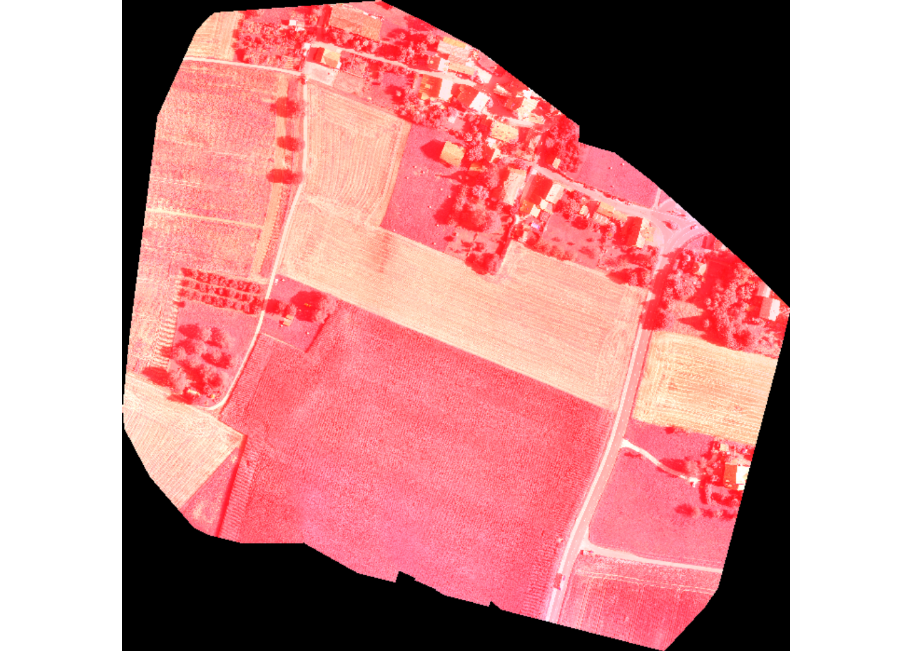

### Recorte de la imagen multiespectral para una zona de estudio

Siempre que trabajemos con imágenes multiespectrales, estas cubrirán un área mayor a la zona de estudio, por lo que lo primero que tendremos que realizar es el recorte de la zona de estudio de la imagen multiespectral.

El recorte nos permite enfocar nuestro análisis únicamente en el área de interés, reduciendo así la cantidad de datos y facilitando el procesamiento.

Para realizar el recorte, necesitamos definir una extensión (extensión espacial) que especifique los límites de la zona de estudio. Para esto utilizaremos un polígono en formato Shapefile (.shp) que representa la zona de estudio.

La creación de este polígono la podemos realizar desde un programa de Sistemas de Información Geográfica (SIG), como podría ser QGis.

##### Carga del archivo vectorial

Cargaremos el polígono en el entorno de R, con la función *read_sf()*.

```r
# Establecemos la ruta del polígono
ruta_poligono <-"D:/Zona_estudio.shp" #Adaptar al polígono generado en QGIS previamente

# Cargamos el polígono con la función read_sf()
poligono <- read_sf(ruta_poligono)
```

##### Creacción de función para recortar la Imagen

Una vez que cargamos el polígono de la zona de estudio, procedemos a realizar una función que recorte una imagen multiespectral utilizando este polígono.

La función que vamos a crear se llamará recortar_imagen().

Esta va a realizar los siguientes pasos: 
1. Comprobación del Sistema de Coordenadas: Verifica si la imagen raster y el polígono tienen el mismo sistema de coordenadas. En el caso de que los sistemas de coordenadas no coinciden, transforma el sistema de coordenadas del polígono para que coincida con el del raster.
2. Recorte del Raster: Se usa la función crop() para recortar la imagen raster a la extensión del polígono, eliminando las partes que están fuera del área de interés definida por el polígono.
3. Aplicación de la Máscara del Polígono: Se usa la función mask() para aplicar la máscara del polígono al raster recortado, asegurando que sólo se mantengan los datos dentro del polígono.

Por último, la función devuelve el raster recortado y enmascarado.

```r
# Creamos una función para recortar la imagen multiespectral
recortar_imagen <- function(raster){
   
  # Comprobación del Sistema de Coordenadas 
  if (st_crs(poligono) != crs(raster)) {
    # Transformación del sistema de coordenadas
    poligono  <- st_transform(poligono , crs(raster))
  }
  
  # Recorte del Raster
  raster_recortado <- crop(raster, poligono)
  
  # Aplicación de la Máscara del Polígono
  raster_recortado <- mask(raster_recortado, poligono)
  
  # Devolución del Raster recortado y enmascarado
  return(raster_recortado)
}
```

##### Recorte de la imagen

Procedemos a recortar la imagen con *recortar_imagen()*.

```r
imagen_recortada <- recortar_imagen(imagen_multiespectral)
```

##### Comprobamos de que se ha recortado correctamente

Realizamos una comprobación de que se ha recortado la imagen visualizandola.

```r
# Comprobamos de que se recorta correctamente
plotRGB(imagen_recortada, r = 1, g = 2, b = 3)
```

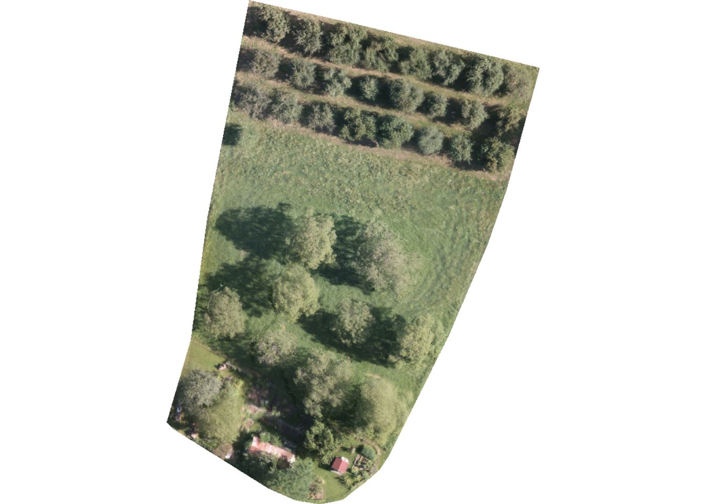

##### Guardado de la imagen recortada

Guardamos la imagen recortada con la función *write_raster()*.

```r
# Guardamos Imagen en formato .tiff
writeRaster(imagen_recortada, "D:/Imagen_recortada.tiff", overwrite=TRUE)
```

### Calculo de Índices de Vegetación

Los índices de vegetación son métricas calculadas a partir de datos multiespectrales que permiten evaluar la salud y la cobertura de la vegetación.

En esta sección, calcularemos tres de los índices de vegetación más comunes: el NDVI (Índice de Vegetación de Diferencia Normalizada), el EVI (Índice de Vegetación Mejorado) y el SAVI (Índice de Vegetación Ajustado por el Suelo).

##### Índice de Vegetación de Diferencia Normalizada (NDVI)

El NDVI es uno de los índices de vegetación más utilizados en teledetección para monitorear la salud de la vegetación. Utiliza las bandas del infrarrojo cercano (NIR) y el rojo (RED) para medir la cantidad y vigor de la vegetación verde.

Se calcula con la siguiente fórmula:

```math
NDVI = \frac{NIR - RED} {NIR + RED}
```

Los valores del NDVI oscilan entre -1 y 1. Valores positivos cercanos a 1 indican vegetación densa y saludable, mientras que valores cercanos a 0 indican vegetación escasa o estrés. Valores negativos generalmente corresponden a superficies de agua, nubes, nieve o áreas sin vegetación.

##### Índice de Vegetación Ajustado por el Suelo (SAVI)

El SAVI ajusta el NDVI para tener en cuenta la influencia del suelo en áreas con poca vegetación. Este ajuste es crucial en regiones donde el suelo expuesto afecta significativamente los valores del NDVI. La fórmula del SAVI es:

```math
SAVI = \frac{(NIR - RED)·(1 + L)} {(NIR + RED + L)}
```

donde: L es un factor de corrección que varía según la densidad de la vegetación. Comúnmente se utiliza un valor de 0.5.

Interpretación de los valores de SAVI:

- Valores Altos (Cercanos a 1): Indican vegetación densa y saludable. En estas áreas, la influencia del suelo es mínima.
- Valores Moderados (Entre 0.2 y 0.8): Representan áreas con vegetación moderada. Estas pueden ser praderas, cultivos en crecimiento o vegetación menos densa.
- Valores Bajos (Cercanos a 0): Indican áreas con poca o ninguna vegetación. En estas áreas, la influencia del suelo es significativa y el SAVI ajusta los valores para reflejar con mayor precisión la cantidad de vegetación presente.
- Valores Negativos: Pueden indicar superficies de agua, nubes, nieve o áreas sin vegetación.

##### Creación de funciones para calcular

Una vez que conocemos que es cada índice, podemos crear funciones en R, que posteriormente calcularán los índices.

Función *calculadora_NDVI()*: Esta función calcula el NDVI utilizando la fórmula estándar del índice.

```r
# Creamos la calculadora del NDVI
calculadora_NDVI <- function(raster){
  # Extracción de la banda roja
  banda_red <- raster[[1]] 
  
  # Extracción de la banda infraroja
  banda_nir <- raster[[4]] 
  
  # Calculo del NDVI
  ndvi <- (banda_nir - banda_red) / (banda_nir + banda_red)
  
  # Retorno de resultado
  return(ndvi)
}
```

Función *calculadora_SAVI()*: Esta función calcula el SAVI.

```r
# Creamos la calculadora de SAVI
# Se puede modificar el valor de L
calculadora_SAVI <- function(raster, L = 0.5) {
  # Extracción de la banda roja
  banda_red <- raster[[1]] 
  
  # Extracción de la banda infraroja
  banda_nir <- raster[[4]] 
  
  # Calculo del SAVI
  savi <- (banda_nir - banda_red) * (1 + L) / (banda_nir + banda_red + L)
  
  # Retorno de resultado
  return(savi)
}
```

##### Aplicación de la funciones de Índices de Vegetación

Se procede a calcular dichos índices de vegetación a partir de la imagen recortada.

```r
# Calculamos el NDVI de la imagen recortada
ndvi <- calculadora_NDVI(imagen_recortada)

# Calculamos el SAVI de la imagen recortada
savi <- calculadora_SAVI(imagen_recortada)
```

##### Visualizamos los resultados

En esta sección, representaremos gráficamente los diferentes Índices que hemos calculado anteriormente. La función plot() se utiliza para visualizar los indices en forma de un gráfico.

Visualización del NDVI:

```r
# Visualización del NDVI
plot(ndvi, main = "NDVI (Índice de Vegetación de Diferencia Normalizada)")
```

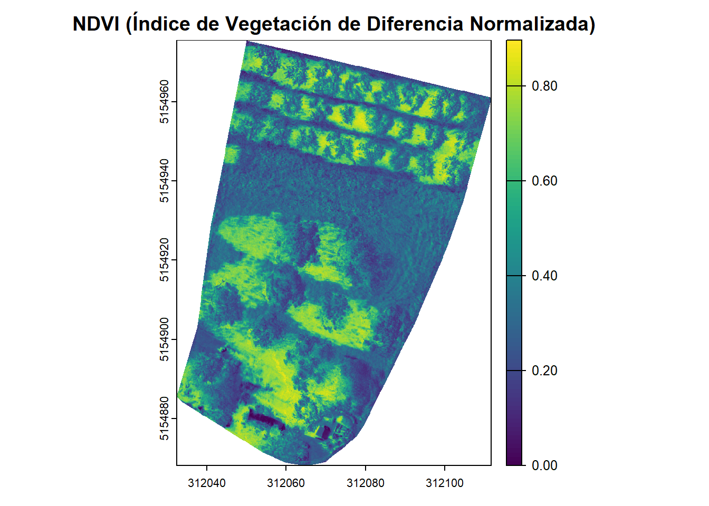

Visualización del SAVI:

```r
# Visualización del SAVI
plot(savi, main = "SAVI (Índice de Vegetación Ajustado por el Suelo)")
```

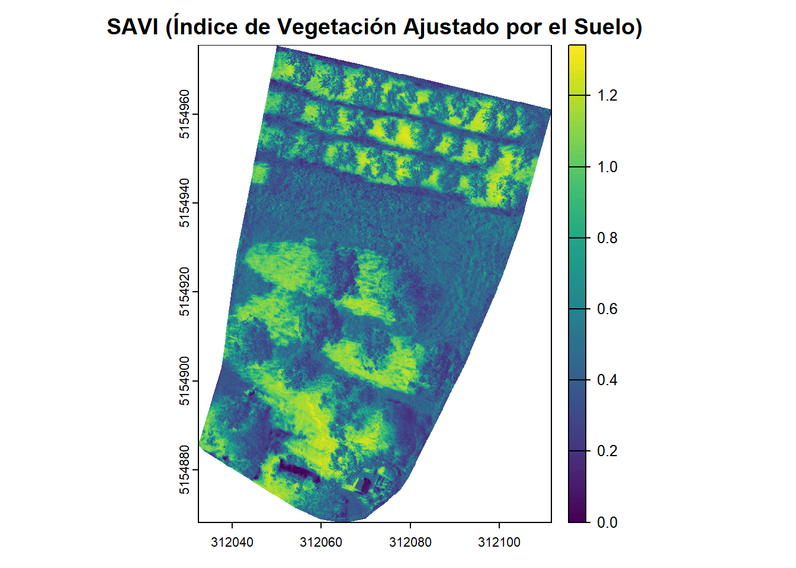

### Creación de mapas

En esta sección, crearemos mapas a partir de nuestros datos de índices de vegetación. Para ello, primero transformaremos los datos raster en un data frame.

Esta transformación facilita la manipulación y visualización de los datos con herramientas de gráficos como *ggplot2*.

##### Transformamos raster a data frame

El siguiente código convierte los datos del NDVI, que están en formato raster, a un data frame. Esto se hace utilizando la función *as.data.frame()*, y se incluyen las coordenadas x e y para cada valor del NDVI. Luego, renombramos las columnas del data frame para mayor claridad.

```r
# Convertimos a data frame
ndvi_df <- as.data.frame(ndvi, xy = TRUE)

# Modificamos los nombres de las columnas
colnames(ndvi_df) <- c("x", "y", "ndvi")
```

Hacemos lo mismo con el Índice SAVI:

```r
# Convertimos a data frame
savi_df <- as.data.frame(savi, xy = TRUE)

# Modificamos los nombres de las columnas
colnames(savi_df) <- c("x", "y", "savi")
```

##### Creación del mapa con ggplot2

En esta sección, utilizaremos ggplot2 para crear un mapa que visualice los valores de los índices.

Esto lo realizaremos de la siguiente forma:

1. Creamos el gráfico base: Se Utiliza *ggplot()* para iniciar el gráfico.
2. Se añaden los datos: Se usa *geom_raster()* para añadir los datos desde el data frame, mapeando las coordenadas x e y, y los valores de los indices a los colores del gráfico.
3. Configuración de la escala de colores: Se aplica *scale_fill_gradientn()* para definir una escala de colores que va de marrón (bajos valores) a verde (altos valores), con na.value para manejar valores faltantes y name para la leyenda.
4. Ajuste de coordenadas: Se usa *coord_fixed()* para asegurar que las unidades en el eje x y el eje y tengan la misma escala.
5. Tema minimalista: Se usa *theme_minimal()* para un diseño limpio y sencillo.
6. Añadimos títulos y etiquetas: Se usa *labs()* para agregar un título al mapa y etiquetas a los ejes.
7. Añadimos elementos de anotación: Se usa *annotation_scale()* para añadir una escala al mapa y *annotation_north_arrow()* para agregar una flecha de norte.
8. Personalización del tema: Configuración del borde del panel y las líneas de la cuadrícula.

Primero lo hacemos con el índice NDVI:

```r
# Creamos el gráfico base
ggplot() +
  # Se añaden los datos
  geom_raster(data = ndvi_df, aes(x = x, y = y, fill = get("ndvi"))) +
  
  # Configuración de la escala de colores
  scale_fill_gradientn(colors = c("brown", "yellow", "green"), 
                       na.value = "transparent",
                       name = "NDVI") +
  # Ajuste de coordenadas
  coord_fixed() +
  # Tema minimalista
  theme_minimal() +
  # Añadimos títulos y etiquetas
  labs(title = "Mapa de NDVI", x = "Longitud", y = "Latitud")+
  # Añadimos ecala
  annotation_scale() +
  # Añadimos flecha del norte
  annotation_north_arrow(location='tr')+
  # Personalización del tema
  theme(
    panel.border = element_rect(colour = "black", fill = NA, size = 1),
    panel.grid.major = element_line(colour = "black", size = 0.2, linetype = "dashed"),
    panel.grid.minor = element_blank())
```

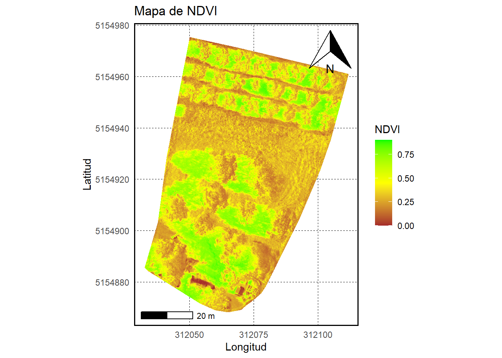

Y por último con el índice SAVI:

```r
ggplot() +
  geom_raster(data = savi_df, aes(x = x, y = y, fill = get("savi"))) +
  scale_fill_gradientn(colors = c("brown", "yellow", "green"), 
                       na.value = "transparent",
                       name = "SAVI") +
  coord_fixed() +
  theme_minimal() +
  labs(title = "Mapa de SAVI", x = "Longitud", y = "Latitud")+
  annotation_scale() +
  annotation_north_arrow(location='tr')+
  theme(
    panel.border = element_rect(colour = "black", fill = NA, size = 1),
    panel.grid.major = element_line(colour = "black", size = 0.2, linetype = "dashed"),
    panel.grid.minor = element_blank())
```

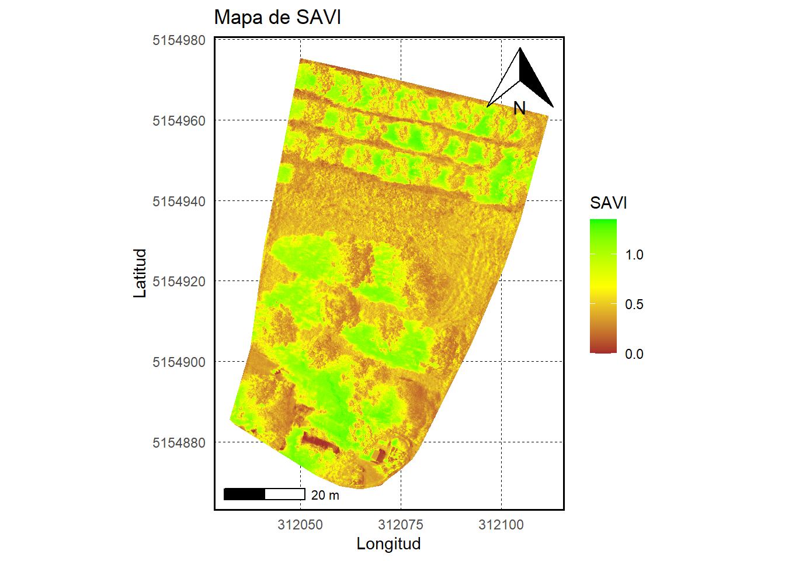

En el caso de querer guardar los mapas en formato .pdf, lo primero que tendremos que realizar es la creación de un objeto que contenga el mapa.

En este caso, lo realizaremos directamente con los dos mapas de los índices.

```r
# Mapa NDVI
mapa_ndvi <- ggplot() +
  geom_raster(data = ndvi_df, aes(x = x, y = y, fill = get("ndvi"))) +
  scale_fill_gradientn(colors = c("brown", "yellow", "green"), 
                       na.value = "transparent",
                       name = "NDVI") +
  coord_fixed() +
  theme_minimal() +
  labs(title = "Mapa de NDVI", x = "Longitud", y = "Latitud")+
  annotation_scale() +
  annotation_north_arrow(location='tr')+
  theme(
    panel.border = element_rect(colour = "black", fill = NA, size = 1),
    panel.grid.major = element_line(colour = "black", size = 0.2, linetype = "dashed"),
    panel.grid.minor = element_blank())

# Mapa SAVI
mapa_savi <- ggplot() +
  geom_raster(data = savi_df, aes(x = x, y = y, fill = get("savi"))) +
  scale_fill_gradientn(colors = c("brown", "yellow", "green"), 
                       na.value = "transparent",
                       name = "SAVI") +
  coord_fixed() +
  theme_minimal() +
  labs(title = "Mapa de SAVI", x = "Longitud", y = "Latitud")+
  annotation_scale() +
  annotation_north_arrow(location='tr')+
  theme(
    panel.border = element_rect(colour = "black", fill = NA, size = 1),
    panel.grid.major = element_line(colour = "black", size = 0.2, linetype = "dashed"),
    panel.grid.minor = element_blank())
```

En el caso de que deseemos guardar los mapas lo podemos realizar con la función ggsave(). Con esto podremos guardar el mapa generado en un archivo PDF.


```r
# Guardamos el Mapa del Índice NDVI
ggsave("D:/Mapa_NDVI.pdf", plot = mapa_ndvi, width = 10, height = 8)

# Guardamos el Mapa del Índice SAVI
ggsave("D:/Mapa_SAVI.pdf", plot = mapa_savi, width = 10, height = 8)
```
